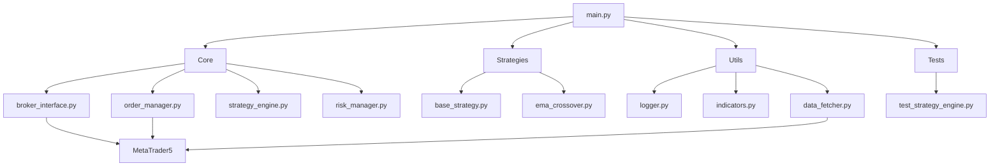
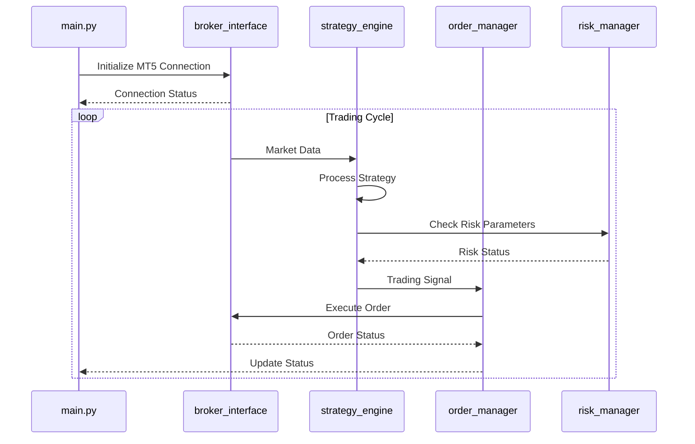

# Architecture du Bot de Trading

## Diagramme de Composants

## Flow de Données

## Description des Composants

### Core
- **broker_interface.py**: Gère la connexion MT5 et les interactions avec le broker
- **order_manager.py**: Gère l'exécution et le suivi des ordres
- **strategy_engine.py**: Orchestre l'exécution des stratégies
- **risk_manager.py**: Applique les règles de gestion des risques

### Strategies
- **base_strategy.py**: Classe abstraite définissant l'interface des stratégies
- **ema_crossover.py**: Implémentation de la stratégie EMA Crossover

### Utils
- **logger.py**: Système de logging centralisé
- **indicators.py**: Calculs des indicateurs techniques
- **data_fetcher.py**: Récupération et stockage des données

### Tests
- **test_strategy_engine.py**: Tests unitaires du moteur de stratégie 